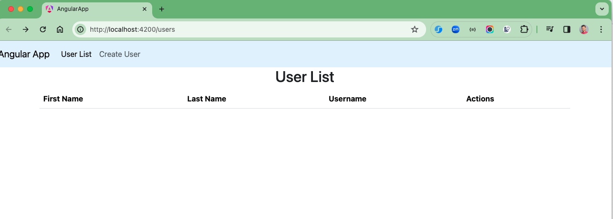
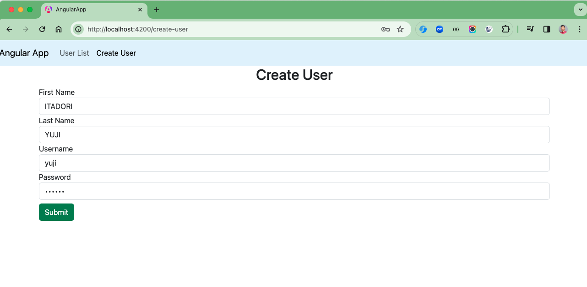
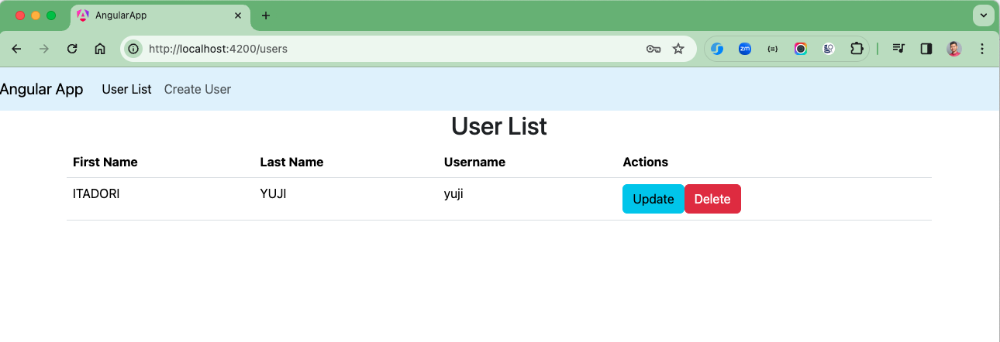

# spring-boot-angular-application-example
Spring Boot Angular Application Example

### Things todo list

1. Clone this repository: `git clone https://github.com/hendisantika/spring-boot-angular-application-example.git`
2. Navigate to the folder: `cd spring-boot-angular-application-example`
3. Go to Backend folder then run the application: `mvn clean spring-boot:run`
4. Open new terminal then go to angular-app folder: `ng serve -o`
5. Open your favorite browser: http://localhost:4200

### Image Screenshot

Home Page

Add New User

User List

